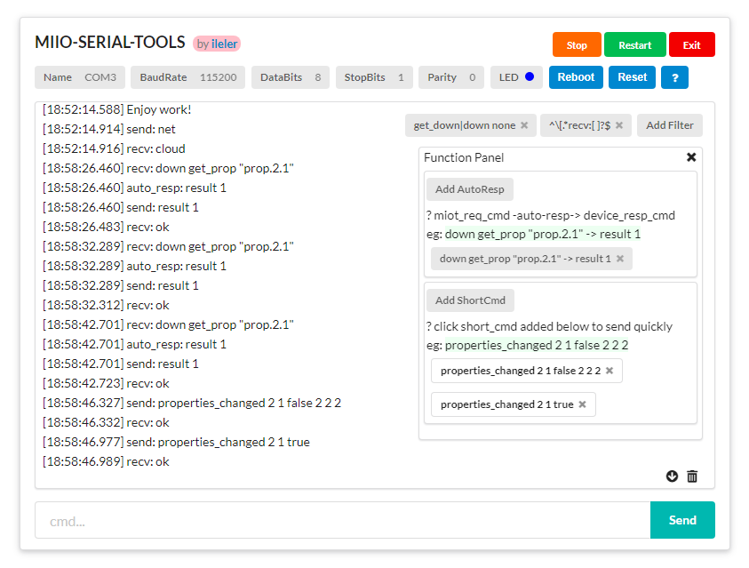
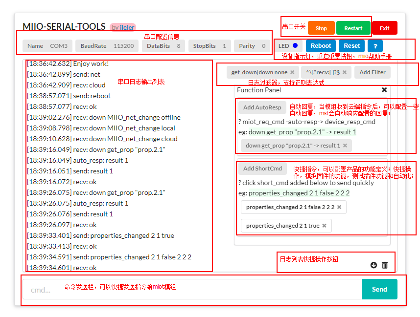

# MIIO Serial Tools  
**软件所有功能基于[iot.mi.com](https://iot.mi.com/new/doc/embedded-development/wifi/standard-protocol.html)开发**  
`后端`开发者（固件开发）可以依据**产品功能定义**利用[mst](https://github.com/ileler/miio-serial-tools)来**模拟固件功能**，便于`前端`开发者（米家APP插件开发）真实且高效的**联调接口**  

软件截图：    
软件介绍：    

> 串口配置信息：  
串口 -> miot模组  
VCC  -> 3V3  
GND  -> GND  
RXD	 -> IO15(指令输出) / IO2(LOG输出)  
TXD  -> IO13(指令输入)  

